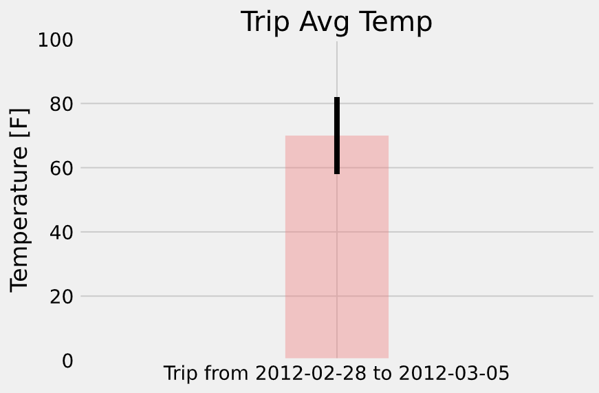
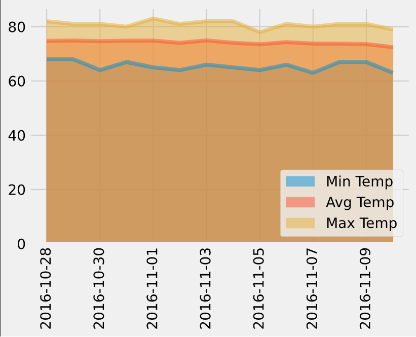

# SQLAlchemy Project - Climate Analysis

## Climate Analysis and Exploration

In this project, Python and SQLAlchemy and Matplotlib are employed to do basic climate analysis and data exploration of the climate database.

* SQLAlchemy `create_engine` is used to connect to the sqlite database (climate database).

* SQLAlchemy `automap_base()` is used to reflect the tables into classes.

### Precipitation Analysis

* A query is designed to retrieve the last 12 months of precipitation data.

* By selecting the `date` and `prcp` values, the query results are loaded into a Pandas DataFrame and the values are sorted by `date`.

* The results are plotted using the DataFrame `plot` method.

  

### Station Analysis

* Queries are designed to calculate the total number of stations and to find the most active stations.

* A query is designed to retrieve the last 12 months of temperature observation data (TOBS).

    

- - -

## Climate App

A Flask API is created with the following routes:

### Routes

* `/`

  * Home page.

  * Lists all routes that are available.

* `/api/v1.0/precipitation`

  * Returns a JSON list of a dictionary of data using `date` as the key and `prcp` as the value.

* `/api/v1.0/stations`

  * Returns a JSON list of stations from the dataset.

* `/api/v1.0/tobs`
 
  * Returns a JSON list of temperature observations (TOBS) of the most active station for the previous year.

* `/api/v1.0/<start>` and `/api/v1.0/<start>/<end>`

  * Returns a JSON list of the minimum temperature, the average temperature, and the max temperature for a given start or start-end range.

### Temperature Analysis I

* The average temperature in June at all stations across all available years in the dataset is identified aong with the average December temperature.

* An unpaired t-test is used to find if there is a statistically significant difference between the temperatures in June and December. An unpaired t-test analysis is applied due to having two independent groups; that are tempratures of two separate months with two seperate conditions.

* Since the p-value is much smaller than 0.05, the null hypothesis is rejected, meaning the average of temperatures in June and December have a statistically significant difference.

### Temperature Analysis II

* A function called `calc_temps` that accepts a start date and end date in the format `%Y-%m-%d` is developed to return the minimum, average, and maximum temperatures for that range of dates.

* The min, avg, and max temperature for a specific time range is displayed as a bar chart.

  * The average temperature is used as the bar height.

  * The peak-to-peak (TMAX-TMIN) value is used as the y error bar (YERR).

    

### Daily Rainfall Average

* Pandas is used to plot an area plot for the averages for the min, avg, and max temperatures.

  
